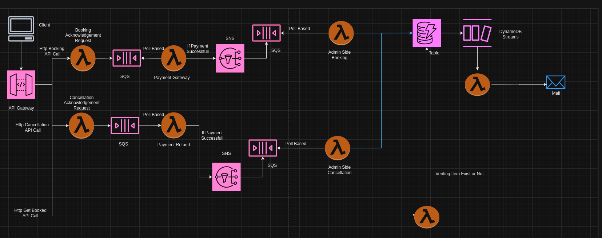

# AWS-Serverless-Booking-System

This is Serverless Architecture for a Ticket Booking System.
I have used service like API Gateway, Lambda Function, SQS, SNS, DynamoDB.

I have used terraform to create my architecture.
API Gateway:

1. /book
2. /cancel
3. /booked

/book:
It can send show id and user id tolambda function named book-ack-function.
Which acknowledge the request and send it to SQS queue.
From this queue Book-payment-function triggers which helps payment to happen from user to admin.
If payment happen successfully then It publish a SNS topic.
SQS queue is subcribe to SNS topic so message goes to SQS queue and from it triggers a lambda function(book-entry-function) which enters item in dynamoDB Table.
from dynamoDB streams one function calls which sends a email through SES.

/cancel:
It can send show id and user id to lambda function named cancel-ack-function.
Which acknowledge the request and send it to SQS queue.
From this queue Cancel-payment-function triggers which helps payment to happen from admin to user.
If payment happen successfully then It publish a SNS topic.
SQS queue is subcribe to SNS topic so message goes to SQS queue and from it triggers a lambda function(cancel-entry-function) which delete item in dynamoDB Table.
from dynamoDB streams one function calls which sends a email through SES.

/booked:
Through Showid and user id lambda function which shows that item is existed or not.



This is my ticket booking architecture

Create AWS profile

```
$ aws configure --profile terraform_admin
AWS Access Key ID: yourID
AWS Secret Access Key: yourSecert
Default region name : aws-region
Default output format : env
```

For Deployment install node modules under each lambda function folder through this command
Run Bash file install node modules

```
bash install_node_modules.sh
```

Run Bash file zip create

```
bash zip_create.sh
```

Run following commands in root directory of project

```
terraform init
terraform apply
```

For testing you can call /book and give any random showid and userid in string format  
then call /booked to see record exist or not
then call /cancel to delete record

Delete Deployment

```
terraform destory
```

Thank you.
